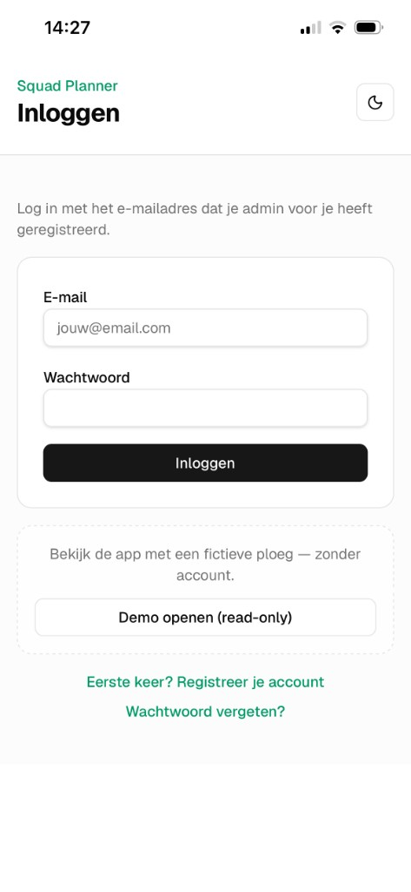
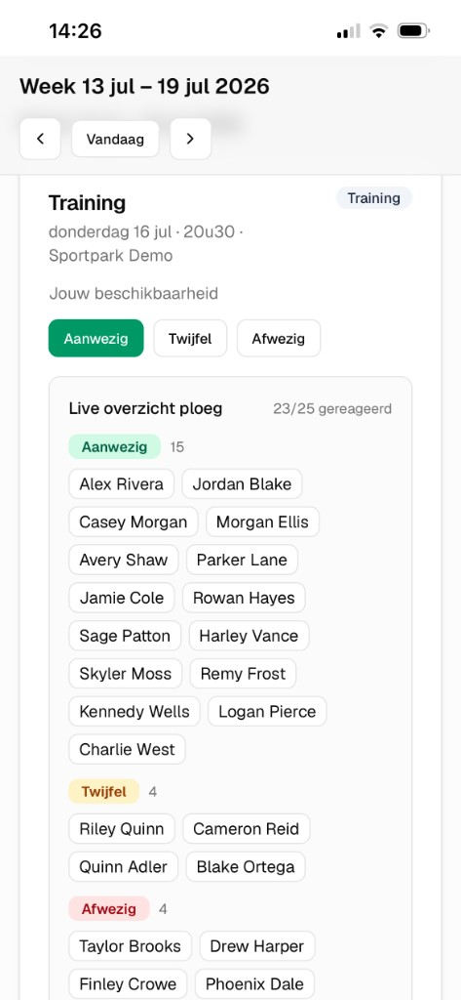
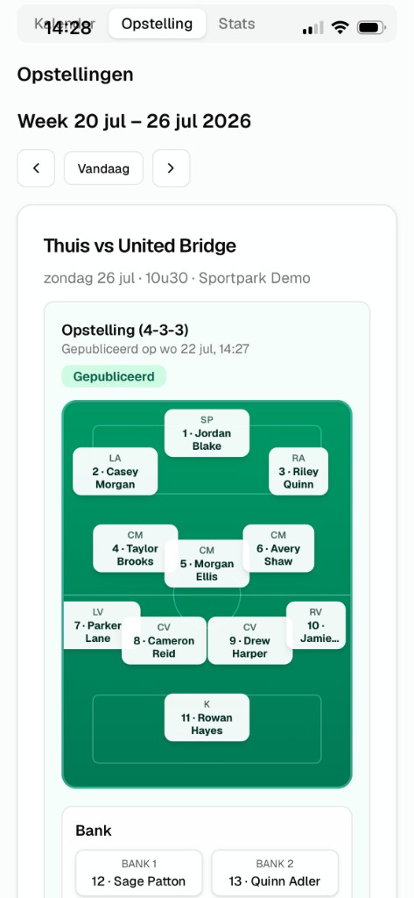

# Squad Planner

**Team planning app for amateur football clubs** — availability, lineups, match stats and calendar sync in one place.

Built as a real product for a club team, with authentication, roles, push reminders and automatic RBFA (Belgian FA) calendar sync.

| | |
|---|---|
| **Live demo (no login)** | [squad-planner-beige.vercel.app/demo](https://squad-planner-beige.vercel.app/demo) |
| **Production app** | [squad-planner-beige.vercel.app](https://squad-planner-beige.vercel.app) |

> **Demo tip:** open the demo and use the **Speler / Admin** switch to explore both views. Everything is **read-only** (fictional squad, no account needed).

---

## Problem → solution

Amateur clubs often organise via WhatsApp and spreadsheets: who is available, who starts, who scored.  
**Squad Planner** turns that into a mobile-friendly web app (PWA) with clear player vs admin roles.

---

## Screenshots

<p align="center">
  
  &nbsp;
  
  &nbsp;
  
</p>

| Login + demo | Availability | Published lineup |
|:---:|:---:|:---:|
| Portfolio entry without an account | Present / doubt / absent + live squad overview | Formation, shirts, bench |

---

## Features

- **Calendar** — trainings & matches (week / month views)
- **Availability** — present / doubt / absent per event, with live team overview
- **Lineups** — formations, pitch, bench & staff; publish for the squad
- **Match stats** — goals & assists + season totals
- **Roles** — admin vs player (role switch when you are both)
- **Auth** — email + password (invite-only: admin registers emails)
- **Push reminders** — weekly availability nudge (OneSignal + Vercel Cron)
- **RBFA sync** — match calendar imported from the Belgian Football Association API
- **PWA** — add to home screen (iOS / Android) with custom app icon
- **Public demo** — recruiter-friendly, fictional data, read-only

---

## Tech stack

| Layer | Choice |
|-------|--------|
| Framework | Next.js 16 (App Router), React 19 |
| UI | Tailwind CSS v4, shadcn/ui |
| Backend | Server Actions + API routes (cron) |
| Data & Auth | Supabase (PostgreSQL + Auth) |
| Security | Row Level Security (RLS) on public tables |
| Push | OneSignal |
| Hosting | Vercel (+ Cron) |
| Language | JavaScript |

**Architecture note:** the browser does not write to the database directly. Data flows through server actions with auth checks; the service role is used on the server, and RLS protects the public API surface.

---

## Development phases

| Phase | Focus | Status |
|-------|--------|--------|
| 1–5 | Frontend: calendar, lineup, stats, UX | Done |
| 6a–c | Supabase schema; persist availability, lineups & stats | Done |
| 6d–e | Auth, admin (players & agenda), Vercel deploy | Done |
| 7 | Email + password auth (replacing magic link) | Done |
| 8 | Push reminders (OneSignal + cron) | Done |
| 9 | RBFA match calendar sync | Done |
| 10 | PWA homescreen icons (iOS / Android) | Done |
| 11 | Row Level Security policies | Done |
| 12 | Public read-only demo for portfolio | Done |

--- 

## Highlights for recruiters

- End-to-end product: UI → server actions → Postgres in production
- Role-based UX (player vs admin) with a real club workflow
- External API integration (RBFA GraphQL datalake)
- Scheduled jobs & web push in production
- Security hygiene: env secrets, service role vs anon, RLS

---

## Local development

```bash
npm install
cp .env.example .env.local   # fill in secrets
npm run dev
```

Full setup (Supabase Auth, env vars, push, deploy, troubleshooting):  
**[docs/DEVELOPMENT.md](docs/DEVELOPMENT.md)**

---

## License

Personal portfolio / club project.
